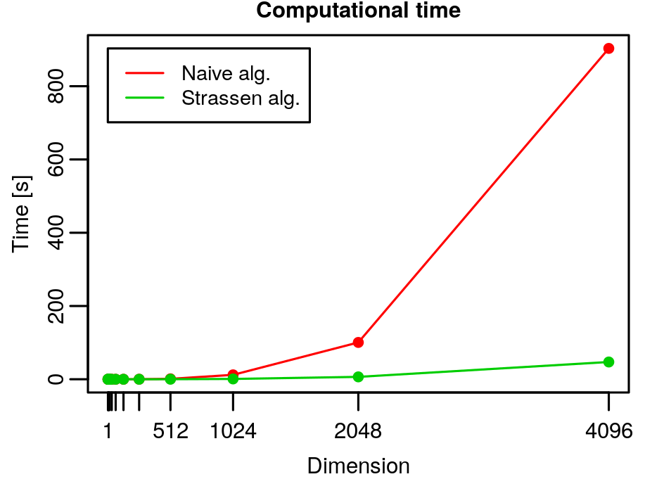
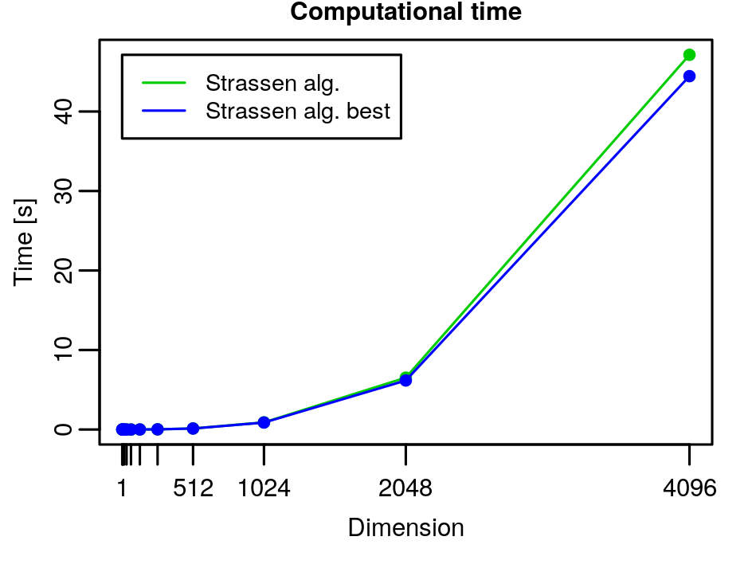

# Matrix Multiplication: Homework

*Clone the Strassen’s project template from*

​										https://github.com/albertocasagrande/AD_strassen_template

*and solve the following exercises.*

1. *Generalize the implementation to deal with non-square matrices.*

   The solution can be found in the folder [Strassen_alg_rect](../Strassen_alg_rect), in particular the functions `strassen_matrix_multiplication` and `strassen_matrix_multiplication_best` in the [strassen.c](../Strassen_alg_rect/src/strassen.c) file.

   The idea is to embed the two rectangular matrices to be multiplied into the closest power of $2$ bigger than the biggest size through a padding operation (fill the spaces with zeros). In this way we can apply the Strassen's algorithm. The result will be a bigger matrix with the needed rectangular matrix in the top left corner and $0$s where the matrix should be finished.

2. *Improve the implementation of the Strassen’s algorithm by reducing the memory allocations and test the effects on the execution time.*

   The solution can be found in the function `strassen_matrix_multiplication_best` (and consequently in the function `strassen_aux_best`), contained in the file `strassen.c` in the folder [Strassen_alg](../Strassen_alg).

   I used only $2$ matrices `SA` and `SB` for the $S$ matrices, instead of allocating $10$ matrices, while for the $P$ matrices I used $4$ matrices (`PA`, `PB`, `PC`, `PD`) instead of $7$. I firstly computed $P_2, P_4, P_5$ and $P_6$ in `PA`, `PB`, `PC`, `PD` respectively, to be able to compute $C_{11}$, then I computed $P_1$ in `PD` (so replacing $P_6$) to be able to compute $C_{12}$, then I computed $P_3$ in `PA` (so replacing $P_2$) to be able to compute $C_{21}$, lastly I computed $P_7$ in `PB` (so replacing $P_4$) to be able to compute the last matrix $C_{22}$.

   In the following graphs we can see that only in the last two/three points the time is significantly different from $0$. Unfortunately, we have too few significant points to establish with certainty that the complexity of the naive algorithm is $\Theta(n^3) = \Theta(n^{\log_2 8})$ and the one of the Strassen's algorithm is $\Theta(n^{\log_2 7})$, even though the graph is growing very quickly. The problem is that with high power of $2$ in $n$ the matrices become very very big and are impossible to store in memory.

   
   
   We can see that the Strassen's algorithm is much much more efficient than the naive algorithm.
   
   

Moreover, we can see that the Strassen's algorithm which uses only $6$ matrices instead of $17$ is also faster,beside being more memory efficient.