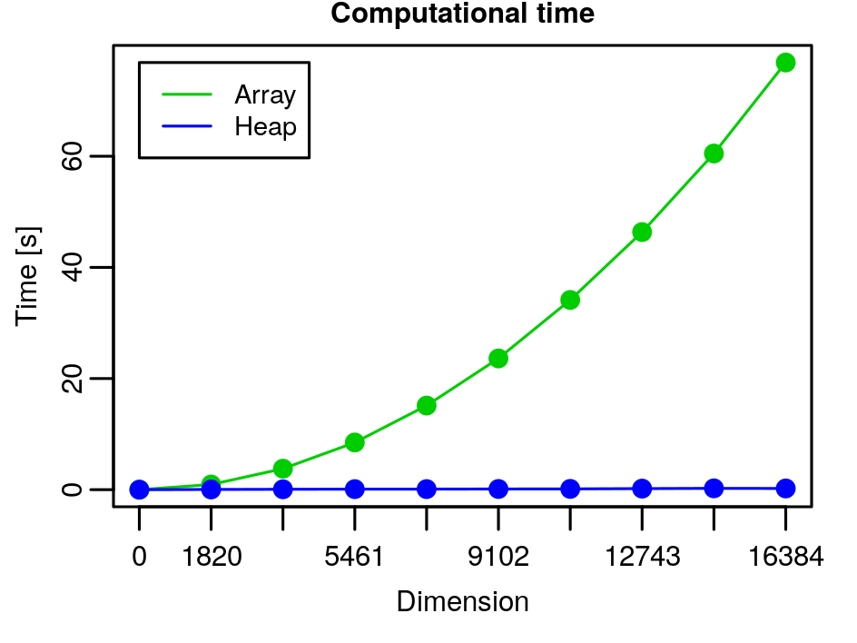
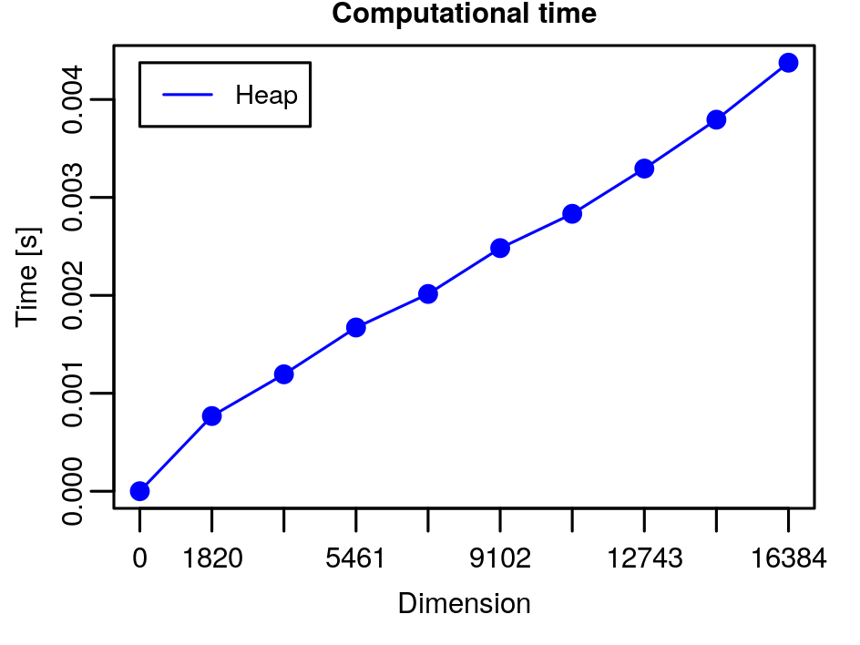

# Binary Heaps: Homework


- *Implement the array-based representation of binary heap together with the functions $\texttt{HEAP_MIN}$, $\texttt{REMOVE_MIN}$, $\texttt{HEAPIFY}$, $\texttt{BUILD_HEAP}$, $\texttt{DECREASE_KEY}$, and $\texttt{INSERT_VALUE}$.*

  The solution can be found in the file `binheap.c` in the folder [Binary_heaps](../Binary_heaps), with the corresponding names `min_value`, `extract_min`, `heapify`, `build_heap`, `decrease_key` and `insert_value`. The functions `is_heap_empty`, `swap_keys`, `find_the_max`, `delete_heap`, and `print_heap` are also added.

- *Implement an iterative version of $\texttt{HEAPIFY}$.*

  The solution can be found in the function `heapify`, contained in the file `binheap.c` in the folder [Binary_heaps](../Binary_heaps).

- *Test the implementation on a set of instances of the problem and evaluate the execution time.*

  After running `test_delet_min` the following output was generated:

  ```bash
  $ ./test_delete_min
  
  n       On Heaps        On Arrays
  0       0.000014        0.000005
  1820    0.039135        0.931853
  3640    0.070701        3.782944
  5461    0.098816        8.491803
  7281    0.105832        15.135461
  9102    0.124539        23.618608
  10922   0.139834        34.143487
  12743   0.193662        46.353465
  14563   0.239347        60.489976
  16384   0.219621        76.866161
  ```

  In the following graph we can see the execution time of the program `test_delet_min`:

  

  We can see that ==????? for the heps the time of extraction is $O(log n)$==: replacing the root’s key costs $\Theta(1)$ and the total cost of $\texttt{HEAPIFY}$ is the height of the heap: $O(\log n)$, so deleting the minimum with the heaps costs $O(\log n)$.

  

- *(Ex. 6.1-7 in [[1]](#ref1)) Show that, with the array representation, the leaves of a binary heap containing $n$ nodes are indexed by $\lfloor n/2 \rfloor + 1, \lfloor n/2 \rfloor + 2, \ldots, n$.*

  Let us consider a binary heap containing $n$ nodes. Since the children of a node $i$ are the nodes $2i$ (the left child) and $2i + 1$ (the right child), we have that the "last" parent, meaning the right-most parent in the second-last level, can at most be the node $\lfloor n/2 \rfloor$. That is because if we suppose that $\lfloor n/2 \rfloor +1$ is a parent node, then its children are the nodes $2(\lfloor n/2 \rfloor +1)$ and $2(\lfloor n/2 \rfloor +1) + 1$, but the left child would be
  $$
  2 \cdot (\lfloor n/2 \rfloor + 1) = 2 \cdot \lfloor n/2 \rfloor + 2 = \begin{cases} 2 \cdot n/2 + 2 & n \text{ even} \\ 2 \cdot (n-1)/2 + 2 & n \text{ odd} \end{cases} = \begin{cases} n + 2 & n \text{ even} \\ n + 1 & n \text{ odd} \end{cases} \\
  \nonumber
  $$
  that is out of the boundary of the array, that is impossible. So all the nodes after the node $\lfloor n/2 \rfloor$ must be leaves. Then we have the proof that the nodes $\lfloor n/2 \rfloor + 1, \lfloor n/2 \rfloor + 2, \ldots, n$ are leaves.

- *(Ex. 6.2-6 in [[1]](#ref1)) Show that the worst-case running time of $\texttt{HEAPIFY}$ on a binary heap of size $n$ is $\Omega(\log n)$.*
  *(**Hint**: For a heap with $n$ nodes, give node values that cause $\texttt{HEAPIFY}$ to be called recursively at every node on a simple path from the root down to a leaf.)*

  Let us consider a binary heap of size $n$. Since a simple path from the root down to a leaf is the height of the tree $h$, we have to estimate $h$ in terms of $n$. In a binary tree the root has $2$ children at depth $1$, each of which has $2$ children at depth $2$, etc. Thus, the number of nodes ( $\equiv$ leaves) at depth $h$ is $2^h$. Consequently, the height of a complete binary tree with $m$ leaves, which is the length of the simple path from the root to a leaf, is $\log_2 m$. Since the number of leaves in a complete binary tree is $(n+1)/2$ ($n$ is always odd in a complete binary tree and the number of leaves is $\lceil n/2 \rceil$, as seen in the following exercise), we have that the height is $\log_n (n+1)/2 = \log_2 (n+1) - \log_2 2 = \log_2 (n+1) - 1$. So in the worst case, if $\texttt{HEAPIFY}$ is called for all the height of the tree, it is called $\Omega(\log n)$ times.
  
  For example, with the following array in a Min_heap, when the minimum is deleted $\texttt{HEAPIFY}$ is called recursively at every node on a simple path from the root down to a leaf:
  
  ```mermaid
  graph LR
  A(1) --- B(3) --- c(4) --- D(7) --- E(6) --- F(5) --- G(8)
  ```
  that corresponds to the tree
  
  ```mermaid
  graph TD;
      1---3;
      1---4;
      3---7;
      3---6;
      4---5;
      4---8
  ```

- *(Ex. 6.3-3 in [[1]](#ref1)) Show that there are at most $\lceil n/2^{h+1} \rceil$ nodes of height $h$ in any $n$-element binary heap.*

  > The height of a node in a tree is the number of edges on the longest simple downward path from the node to a leaf, and the height of a tree is the height of its root. The height of a tree is also equal to the largest depth of any node in the tree.

  Let us consider a $n$-element binary heap with height $h$. We have that the height of the root is $h$ and the height of the children of the root is $h-1$, while the height of a leaf is $0$ and the height of the parents of the leaves is $1$.

  Since all the nodes after $\lfloor n/2 \rfloor$ are leaves, we have $\lceil n/2 \rceil$ leaves, so we have $\lceil n/2^{0 + 1} \rceil$ nodes at height $0$. We have a binary heap, so we have a binary tree, thus the number of parents of the leaves will be half the number of the leaves, so we will have $\lceil (n/2)/2 \rceil = \lceil n/4 \rceil = \lceil n/2^{1 + 1} \rceil$ nodes at height 1. Let's assume that we have $\lceil n/2^{(i-1)+1} \rceil = \lceil n/2^i \rceil$ nodes at height $i-1$, their parents will be half of them, so they will be $\lceil (n/2^i)/2 \rceil = \lceil n/2^{i+1} \rceil$, so we have $\lceil n/2^{i+1} \rceil$ nodes at height $i$. So by induction we have $\lceil n/2^{h+1} \rceil$ nodes at height $h$, and we have proved our thesis. Besides, the root is at height $h = \log_2 n$, so we have $\lceil n/2^{\log_2 n + 1} \rceil = \lceil n/2n \rceil = \lceil 0,\ldots \rceil = 1$ node at height $h$.


### References

<a name="ref1"></a>[1] T.H. Cormen, C.E. Leiserson, R.L. Rivest, and C. Stein. *Introduction to Algorithms*. The MIT Press. MIT Press, 2009.