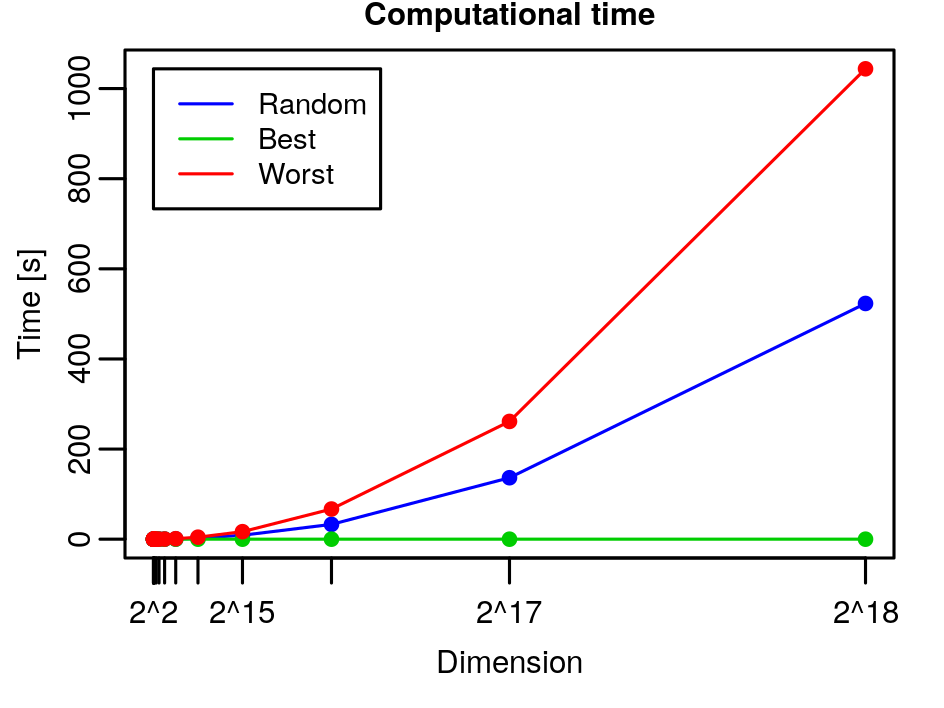
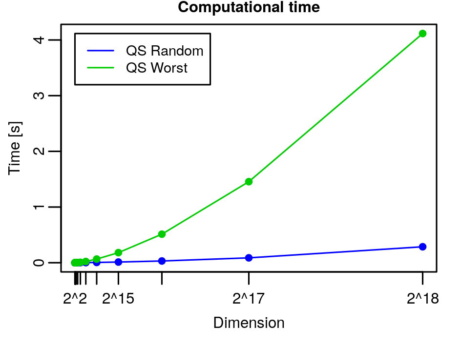
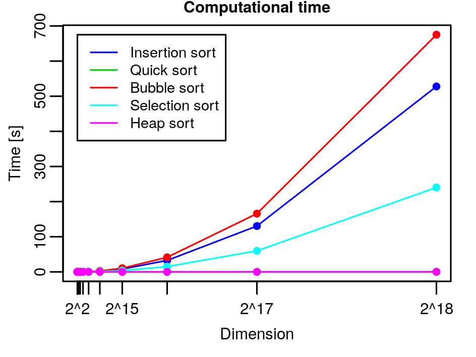

# Sorting: Homework

- *By using the code at:*

  ​                                         https://github.com/albertocasagrande/AD_sorting

  *implement Insertion Sort, Quick Sort, Bubble Sort, Selection Sort, and Heap Sort.*

  The solution with the implemented cod can be found in the files `insertion_sort.c`, `quick_sort.c`, `bubble_sort.c`, `selection_sort.c`, `heap_sort.c` in the folder [Sorting](../Sorting).

- *For each of the implemented algorithm, draw a curve to represent the relation between the input size and the execution-time.*

  For **Insertion sort** we have:

  

  We can see that, as expected, the worst case (red) is the one that performs the worst, the random case (blue) is the one in the middle and the best case (green) is the one that performs better.

  For **Quick Sort** we have:

  

  Again as expected the worst case takes more time than a random case.

  For **Insertion Sort, Quick Sort, Bubble Sort, Selection Sort, and Heap Sort** altogether we have

  

  We can see that the faster are Heap sort and Quick sort (it's under Heap sort), while the worst is Bubble sort.

- *Argue about the following statement and answer the questions*

  1. *Heap Sort on an array $A$ whose length is $n$ takes time $O(n)$.*

     FALSE. The overall complexity of Heap Sort is $O(n \log n)$: `build_max_heap` costs $\Theta(n)$ and `extract_min`  costs $O(\log i)$ per iteration and in total
     $$
     T_H(n) = \Theta(n) + \sum_{i=2}^n O(\log i) \le O(n) + O \left( \sum_{i=2}^n \log n \right) = O(n \log n).
     \nonumber
     $$

  2. *Heap Sort on an array $A$ whose length is $n$ takes time $\Omega(n)$.*

     TRUE. From above we have that
     $$
     T_H(n) = O(n \log n) \ge \Omega(n)
     \nonumber
     $$
     since taken a representative $c n \log n$ of $O(n \log n)$ we have that $c n \log n \ge d n$ for $n > 2$ and $c \ge d$.

  3. *What is the worst case complexity for Heap Sort?*

     The worst case complexity of Heap sort is $O(n \log n)$, since the worst-case running time of `heapify` on a binary heap of size $n$ is $\Omega(\log n)$, as we have seen in the [homework_02_01](homework_02_01_SOLVED.pdf).

  4. *Quick Sort on an array $A$ whose length is $n$ takes time $O(n^3)$.*

     FALSE. We have that in the worst case Quick Sort takes time $\Theta(n^2)$:
     $$
     T_Q(|A|) = T_Q(|S|) + T_Q(|G|) + \Theta(|A|)
     \nonumber
     $$
     and if $|G|=0$ or $|S|=0$ for all recursive call
     $$
     T_Q(n) = T_Q(n - 1) + \Theta(n) = \sum_{i=0}^n \Theta(i) =
     \Theta\left( \sum_{i=0}^n i \right) = Θ(n^2).
     \nonumber
     $$
     So we have that $T_Q \not\in O(n^3)$.

  5. *What is the complexity of Quick Sort?*

     In point 4 we have seen that in the worst case $T_Q \in \Theta(n^2)$. In the best case, with a balanced partition, and in the average case we have that $T_Q \in \Theta(n \log n)$.

  6. *Bubble Sort on an array $A$ whose length is $n$ takes time $\Omega(n)$.*

     TRUE. Since Bubble Sort works by pair-wise swapping the maximum to the right, even if the vector is ordered we have to scan all the vector, so the cost is at least $n$, so $T_B(n) \in \Omega(n)$.

  7. *What is the complexity of Bubble Sort?*

     we have that one swap-block costs $\Theta(1)$ and that the nested for-loop costs $\Theta(i)$, we have that
     $$
     T_B(n) = \sum_{i=2}^n \Theta(i) \cdot \Theta(1) = \Theta \left( \sum_{i=2}^n i \right) = \Theta(n^2).
     \nonumber
     $$

- *Solve the following recursive equation:*
  $$
  T(n) = \begin{cases}
  \Theta(1) & \text{if } n = 32 \\
  3 * T \left( \frac n 4 \right) + \Theta (n^{3/2}) & \text{otherwise}
  \end{cases}
  \nonumber
  $$
  Using the **recursion tree**, we have that our stopping condition is when $n = 32$, so when in our recursion $\frac n{4^i} = 32 \Longleftrightarrow n = 2^5 \cdot 2^{2i} \Longleftrightarrow n = 2^{5 + 2i} \Longleftrightarrow i = \frac{\log_2 n - 5}2$ and choosing $cn^{3/2}$ as representative for $\Theta(n^{3/2})$ we have that
  $$
  \begin{align*}
  T(n) &= 3 * T\left(\frac n4 \right) + \Theta(n^{3/2}) \\
  &\le 3 * T\left( \frac n4 \right) + cn^{3/2} \\
  &\le 3 * \left(3 * T\left(\frac n{16} \right) + c \left(\frac n4 \right)^{3/2} \right) + cn^{3/2} \\
  &= 9 * T\left( \frac n{16} \right) + 3c \left(\frac n4 \right)^{3/2} + cn^{3/2} \\
  &\le 9 * \left(3 * T\left( \frac n{64}\right) + c \left(\frac n{16} \right)^{3/2} \right) + 3c \left(\frac n4 \right)^{3/2} + cn^{3/2} \\
  &\le 27 * T\left( \frac n{64}\right) + 9c \left(\frac n{16} \right)^{3/2} + 3c \left(\frac n4 \right)^{3/2} + cn^{3/2} \\
  &\le \ldots \\
  &\le 3^{ \frac{\log_2 n - 5}2} T(32) + \sum_{i=0}^{\log_2 n} 3^i c \left(\frac n{4^i} \right)^{3/2}
  = 3^{ \frac{\log_2 n - 5}2} \Theta(1) + \sum_{i=0}^{ \frac{\log_2 n - 5}2} 3^i c \frac{n^{3/2}}{4^{3/2i}} \\
  &\le 3^{ \frac{\log_2 n - 5}2} c' + \sum_{i=0}^{ \frac{\log_2 n - 5}2} \frac{3^i}{2^{3i}} c n^{3/2}
  = 3^{ \frac{\log_2 n - 5}2} c' + c n^{3/2} \sum_{i=0}^{ \frac{\log_2 n - 5}2} \left(\frac{3}{2^{3}} \right)^i \\
  &= 3^{ \frac{\log_2 n - 5}2} c' + cn^{3/2} \cdot \frac{(3/8)^{\left(\frac{\log_2 n - 5}2\right)+1} - 1}{3/8-1}
  = 3^{ \frac{\log_2 n - 5}2} c' + cn^{3/2} \cdot \frac{(3/8)^{\frac{\log_2 n - 3}2} - 1}{(3-8)/8} \\
  &= 3^{ \frac{\log_2 n - 5}2} c' -\frac85 cn^{3/2} \cdot \frac{3^{\frac{\log_2 n - 3}2} - 8^{\frac{\log_2 n - 3}2}}{8^{\frac{\log_2 n - 3}2}}
  \end{align*}
  $$
  since $3^{\frac{\log_2 n - 3}2} = (3^{\log_2 n - 3})^{1/2} = \left(\frac{3^{\log_2 n}}{3^3}\right)^{1/2} = \left(\frac{3^{\log_2 3 \log_3 n}}{3^3}\right)^{1/2} = \left(\frac{n^{\log_2 3}}{3^3}\right)^{1/2} = \frac{n^{\frac{\log_2 3}2}}{3^{3/2}}$ (since $\log_b n = \log_b a \cdot \log_a n$ we have $\log_2 n = \log_2 3 \cdot \log_3 n$) and $8^{\frac{\log_2 n - 3}2} = 2^{\frac32(\log_2 n - 3)} = (2^{\log_2 n - 3})^{3/2} = \left(\frac{2^{\log_2 n}}{2^3} \right)^{3/2} = \left(\frac{n}{8} \right)^{3/2}$ we have that
  $$
  \begin{align*}
  &= \frac{n^{\frac{\log_2 3}2}}{3^{3/2}} c' -\frac85 cn^{3/2} \cdot \frac{\frac{n^{\frac{\log_2 3}2}}{3^{3/2}} - (n/8)^{3/2}}{(n/8)^{3/2}} 
  = \frac{n^{\frac{\log_2 3}2}}{3^{3/2}} c' -\frac85 8^{3/2} cn^{3/2} \cdot \frac{\frac{n^{\frac{\log_2 3}2}}{3^{3/2}} - \frac{n^{3/2}}{8^{3/2}}}{n^{3/2}} \\
  &= \frac{n^{\frac{\log_2 3}2}}{3^{3/2}} c' -\frac85 8^{3/2} c \cdot \left(\frac{n^{\frac{\log_2 3}2}}{3^{3/2}} - \frac{n^{3/2}}{8^{3/2}} \right)
  = \frac{n^{\frac{\log_2 3}2}}{3^{3/2}} c' -\frac85 8^{3/2} c \cdot \frac{n^{\frac{\log_2 3}2}}{3^{3/2}} + \frac85 8^{3/2} c\frac{n^{3/2}}{8^{3/2}}\\
  &= \frac{n^{\frac{\log_2 3}2}}{3^{3/2}} \left( c' -\frac{8^{5/2}}5 c \right) + \frac85 c n^{3/2}
  \in O(n^{3/2})
  \end{align*}
  $$
  So we have that $T(n) \in O(n^{3/2})$. Since all the inequalities work also with the $\ge$ , we have that $T(n) \in \Omega(n^{3/2})$, so we have that $T(n) \in \Theta(n^{3/2})$

