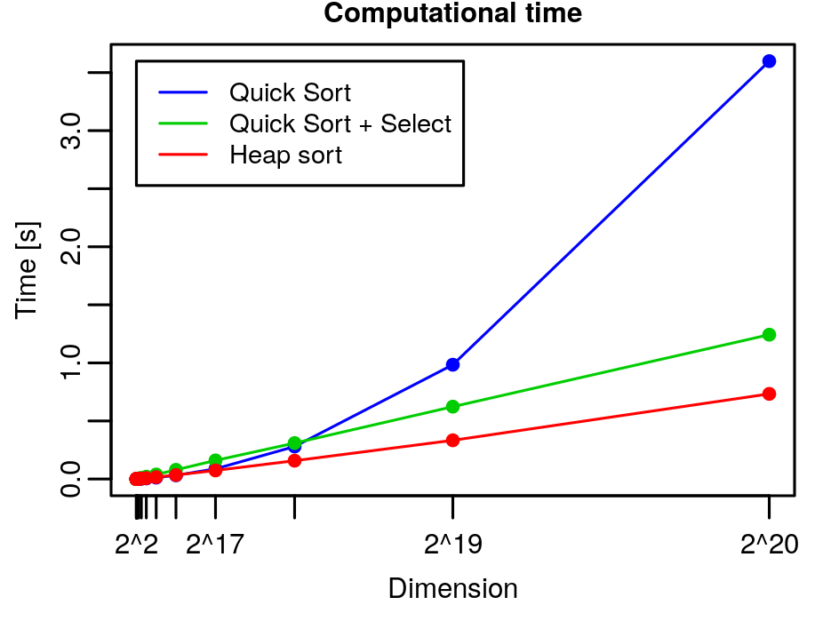

# Sorting: Homework 2

1. <a name="point1"></a> *Generalize the $\mathtt{SELECT}$ algorithm to deal also with repeated values and prove that it still belongs to $O(n)$.*

      To generalize the select algorithm we have seen in order to use it also with arrays with repeated values, we have to change the $\texttt{PARTITION}$ function.

      We will call it $\texttt{SELECT_PARTITION}$ and it divides the array in three sections:

      - one subarray $S$ containing all the values smaller than the pivot,
      - one subarray $P$ containing all the values equal to the pivot,
      - one subarray $G$ containing all the values greater than the pivot.

      The pseudo-code is the following:

      ```pseudocode
      def SELECT_PARTITION(A, l, r, p):
          swap(A, l, p)
      	(p, i, j) ← (i, i + 1, r)
          while i <= j:
              if A[i] > A[p]:         // if A[i] is greater than the pivot
                  swap(A, i, j)       // place it in G
                  j ← j - 1           // increase G's size
              else
                  if A[i] = A[p]:     // if A[i] is equal to the pivot
                      p ← p + 1       // increase P's size
                      swap(A, i, p)   // place it in P
          	        i ← i + 1
                  else                // if A[i] is smaller than the pivot
                      i ← i + 1       // A[i] is already in S
                  end if
              end if
          end while
          for h in l..p:
              swap(A, h, j)          // place the pivots between S and G
              j ← j - 1
              h ← h + 1
          end for
          return j, i-1
      end def
      ```

      The complexity of this partition algorithm is still $\Theta(n)$, since the $\texttt{while}$ is repeated $n$ times and the $\texttt{for}$ is repeated in the worst case (when all the elements are equal to the pivot) $n$ times.

      All the other functions and in particular the $\texttt{SELECT}$ function remain the same. So we still have that the recurrent relation of the $\texttt{SELECT}$ algorithm is
      $$
      T_S(n) = T_S(\lceil n/5 \rceil) + T_S(7n/10 + 6) + \Theta(n)
      \nonumber
      $$
      so its complexity is still $O(n)$.

2. *Download the latest version of the code from*
   
      <p align=center> <i><a href="https://github.com/albertocasagrande/AD_sorting">https://github.com/albertocasagrande/AD_sorting</a></i></p>
      
      *and*
      
       - *Implement the $\texttt{SELECT}$ algorithm of Ex. [1](#point1).*
        - *Implement a variant of the $\texttt{QUICK SORT}$ algorithm using above-mentioned $\texttt{SELECT}$ to identify the best pivot for partitioning.*
        - *Draw a curve to represent the relation between the input size and the execution-time of the two variants of $\texttt{QUICK SORT}$ (i.e, those of Ex. 2 and of Ex. 1 of [this file](#homework_03_01_SOLVED.md)) and discuss about their complexities.*
      
      The solution with the implemented code are the functions `select_index` (with the auxiliary functions `select_pivot` and `select_partition`) and `quick_sort_select` that can be found in the file `select.c` in the folder [05_Sorting](../05_Sorting).
      
      The following plot shows that the red line of Quick Sort + Select in the *random* case is slightly above, so it's slightly worse, than the blue line of Quick Sort in the *random* case, while the yellow line of Quick Sort + Select in the *worst* case is much more below, so it's much more better, than the light blue line of the Quick Sort in the *worst* case. Thus, while the Quick Sort algorithm is better that the Quick Sort + Select algorithm in the *random* case (since I'm already in a good case, and also performing the Select algorithm only slows down the algorithm), for the *worst* case the Select algorithm greatly improves the performance of Quick Sort.

   
   
   Increasing the size of the array to be sorted, we can see that the Quick Sort algorithm with Select, for $n > 2^{18}$, is much more better than the Quick Sort algorithm alone also in the *random* case. Anyway, the Heap Sort algorithm is still better than both of them.
   
   
   
   We have that the Quick Sort algorithm in the *random* case, with a balanced partition, is $\Theta(n \log n)$, while in the worst case, when the array is already sorted, the partition is not balanced at all, since one part is always empty, and the complexity is $\Theta(n^2)$. The Selection algorithm makes sure that every partition of the array is never unbalanced, so that there is never an empty part. In this way, also the worst case falls into the best case of Quick Sort, and the complexity is $\Theta(n\log n)$ in every case. But as we have seen from the plots, we need to have an array of length greater than $2^{18}$ to be able to exploit this, otherwise the Select algorithm, for small values of $n$, is just a burden.
   
   We can see the histograms of the times of the *random* case and of the *worst* case of the two different algorithms of Quick Sort, both run for $1000$ times on an array of length $2^{16}$: the normal one and the one with the Select algorithm.
   
    
   
   We can see that in the *random* case the Quick Sort + Select is slower then the Quick Sort, while in the *worst* case is the opposite, and the medians are quite apart in both cases, so it's not because of a fluctuation.
   
3. *(Ex. 9.3-1 in [[1]](#ref1)) In the algorithm $\texttt{SELECT}$, the input elements are divided into chunks of $5$. Will the algorithm work in linear time if they are divided into chunks of $7$? What about chunks of $3$?*

   If the input elements are divided into chunks of $7$ we have that there will be $\left\lceil \frac n7 \right\rceil$ chunks, there will be $\left\lceil \frac12 \left\lceil \frac n7 \right\rceil \right\rceil$ $m_i$ (median of the chunk $C_i$) greater or equal to $m$ (the median of the $m_i$'s), there will be $\left\lceil \frac12 \left\lceil \frac n7 \right\rceil \right\rceil - 2$ chunks that have at least $3$ elements greater then $m$, there will be at least $4 \left( \left\lceil \frac12 \left\lceil \frac n7 \right\rceil \right\rceil - 2\right) \ge \frac2{7}n - 8$ elements that are greater than $m$. So an upper bound for the number of elements smaller or equal to $m$ is $n - \left( \frac27 n - 8 \right) = \frac57 n + 8$.

   So the recurrence relation becomes:
   $$
   T_S(n) = T_S\left(\left\lceil \frac n7 \right\rceil\right) + T_S\left(\frac57 n + 8\right) + \Theta(n)
   \nonumber
   $$
   *Substitution Method*. Select $cn$ and $c'n$ as representatives of $O(n)$ and $\Theta(n)$ and assume $T_S(m) \le cm$ for all $m < n$,
   $$
   \begin{align*}
   T_S(n) &\le c \left\lceil \frac n7 \right\rceil + c \left( \frac57 n + 8 \right) + c'n \\
   &\le c\left(\frac n7 + 1 \right) + c\left(\frac57 n + 8 \right) + c'n \\
   &\le \frac67 cn + 9c + c'n
   \end{align*}
   $$
   if $c \ge 20c'$, we have that
   $$
   \begin{align*}
   T_S(n) &\le \frac67 cn + 9c + \frac 1{20} cn \\
   &\le \frac{127}{140} cn + 9c
   \end{align*}
   $$
   So $T_S(n) \le cn \Longleftrightarrow \frac{127}{140} cn + 9c \le cn \Longleftrightarrow \frac{127}{140} n + 9 \le n \Longleftrightarrow \frac{13}{140} n \ge 9 \Longleftrightarrow n \ge \frac{1260}{13} \Longleftrightarrow n \ge 97$. Hence, $T_S(n) \le cn$ for $c \ge 20c'$ and $n \ge 327$ so we still have that $T_S(n) \in O(n)$. Thus the algorithm will work in linear time if the input elements are divided into chunks of $7$.

   If the input elements are divided into chunks of $3$ we have that there will be $\left\lceil \frac n3 \right\rceil$ chunks, there will be $\left\lceil \frac12 \left\lceil \frac n3 \right\rceil \right\rceil$ $m_i$ (median of the chunk $C_i$) greater or equal to $m$ (the median of the $m_i$'s), there will be $\left\lceil \frac12 \left\lceil \frac n3 \right\rceil \right\rceil - 2$ chunks that have at least $3$ elements greater then $m$, there will be at least $2 \left( \left\lceil \frac12 \left\lceil \frac n3 \right\rceil \right\rceil - 2\right) \ge \frac26 n - 4 = \frac13 n - 4$ elements that are greater than $m$. So an upper bound for the number of elements smaller or equal to $m$ is $n - \left( \frac13 n - 4 \right) = \frac23 n + 4$.

   So the recurrence relation becomes:
   $$
   T_S(n) = T_S\left(\left\lceil \frac n3 \right\rceil\right) + T_S\left(\frac23 n + 4\right) + \Theta(n)
   \nonumber
   $$
   *Substitution Method*. Select $cn$ and $c'n$ as representatives of $O(n)$ and $\Theta(n)$ and assume $T_S(m) \le cm$ for all $m < n$,
   $$
   \begin{align*}
   T_S(n) &\le c \left\lceil \frac n3 \right\rceil + c \left( \frac23 n + 4 \right) + c'n \\
   &\le c\left(\frac n3 + 1 \right) + c\left(\frac23 n + 4 \right) + c'n \\
   &\le cn + 5c + c'n
   \end{align*}
   $$
   if $c \ge 20c'$, we have that
   $$
   \begin{align*}
   T_S(n) &\le cn + 5c + \frac 1{20} cn \\
   &\le \frac{21}{20} cn + 7c
   \end{align*}
   $$
   So $T_S(n) \le cn \Longleftrightarrow \frac{21}{20} cn + 4c \le cn \Longleftrightarrow \frac{21}{20} n + 4 \le n \Longleftrightarrow \frac{1}{20} n \le -4 \Longleftrightarrow n \le -80$, which is impossible since $n \ge 0$. Hence, $T_S(n) > cn$, so it is not linear: $T_S(n) \not\in O(n)$. Thus the algorithm will *not* work in linear time if the input elements are divided into chunks of $3$.

   <!--Since if we divide the input elements in chunks of $5$ we have that the algorithm is $O(n)$ for $n \ge 140 $, we can say that choosing $5$ is a balance between the number of base cases and the number of recursive calls that will be done.-->

4. *(Ex. 9.3-5 in [[1]](#ref1) Suppose that you have a "black-box" worst-case linear-time subroutine to get the position in $A$ of the value that would be in position $n/2$ if $A$ was sorted. Give a simple, linear-time algorithm that solves the selection problem for an arbitrary position $i$.*

      The algorithm will find the median values using the "black-box" algorithm which is $O(n)$, then it will perform a call of the $\texttt{PARTITION}$ algorithm (or the $\texttt{SELECT_PARTITION}$ algorithm if we have repeated values) that is $O(n)$ in order to have the array partition with all the elements smaller than the median on the left, the median found by the "black-box" algorithm in the right place and all the elements greater than the median on the right. Then it will  perform a recursive step on only the sub-array containing $i$. The code is the following:

      ```pseudocode
      def BLACK_BOX_SELECT(A, i, l, r):
          m ← BLACK_BOX(A)
          if i = m:
              return A[m]
          end if
          PARTITION(A, l, r, m)
          if i < m
              BLACK_BOX_SELECT(A, i, l , m - 1)
          else
              BLACK_BOX_SELECT(A, i, m + 1, r)
          end if
      end def
      ```

      The recurrent relation of the code is $T(n) = T(n/2) + O(n) + O(n) = T(n/2) + O(n)$, and using the recursion tree and choosing $cn$ as representative for $O(n)$ we have that
      $$
      \begin{align*}
      T(n) &= T(n/2) + cn = T(n/4) + cn/2 + cn = \ldots\\
      &= \sum_{i=0}^{\log_2 n} \frac{cn}{2^i} = cn \sum_{i=0}^{\log_2 n} \left(\frac12\right)^i =\\
      &= cn \frac{1 - (1/2)^{\log_2 n +1}}{1 - 1/2} = 2cn \left( 1- \frac1{2^{\log_2 n + 1}} \right) =\\
      &= 2cn \left( 1 - \frac1{2n}\right) = 2cn - c \in O(n)
      \end{align*}
      $$
      so the complexity of the algorithm is linear.

5. *Solve the following recursive equations by using both the recursion tree and the substitution method:*

   - $T_1(n) = 2 * T_1(n/2) + O(n)$

     Using the **recursion tree**, we have that, choosing $cn$ as representative for $O(n)$
     $$
     \begin{align*}
     T_1(n) &= 2 * T_1(n/2) + O(n) \\
     &\le 2 * T_1(n/2) + cn \\
     &\le 2 * (2 * T_1(n/4) + cn/2) + cn \\
     &= 4 * T_1(n/4) + 2cn \\
     &\le 4 *(2 * T_1(n/8) + cn/4) + 2cn \\
     &= 8 * T_1(n/8) + 3cn\\
     &\le \ldots \\
     &\le 2^{\log_2 n} T_1(0) + \log_2 n * cn \\
     &= n * 0 + c n \log_2 n \in O(n \log n)
     \end{align*}
     $$
     or directly
     $$
     T_1(n) = 2 * T_1(n/2) + O(n) \le \sum_{i=0}^{\log_2 n} 2^i c \frac n{2^i} = \sum_{i=0}^{\log_2 n} cn = cn \sum_{i=0}^{\log_2 n} 1 = cn \log_2 n \in O(n \log n)
     \nonumber
     $$
     Using the **substitution method**, we guess that $T_1(n) \in O(n \log n)$. We select a representative for $O(n \log n)$ and $O(n)$, e.g. $cn \log n$ and $c' n$. We assume that $\forall m < n, \; T_1(m) \le cm \log m$. If this is the case,
     $$
     \begin{align*}
     T_1(n) &= 2 * T_1(n/2) + c'n \\
     &\le 2 * c n/2 \log(n/2) + c' n \\
     &= cn (\log n - \log 2) + c'n \\
     &= cn \log n - cn \log 2 + c'n \\
     &= cn \log n - cn + c'n
     \end{align*}
     $$
     if $c' n - cn \le 0 \Longleftrightarrow c' n \le cn \Longleftrightarrow c \ge c'$ then $T_1(n) \le c n \log n$. Thus we have proved by induction that $\forall n \in \mathbb{N}, \; T_1(n) \le c n \log n$ for a proper $c$. So $T_1(n) \in O(n \log n)$.
     
   - $T_2(n) = T_2(\lceil n/2 \rceil) + T_2(\lfloor n/2 \rfloor) + \Theta(1)$

     Using the **recursion tree**, we have that, choosing $c$ as representative for $O(1)$:
     $$
     \begin{align*}
     T_2(n) &= T_2(\lceil n/2 \rceil) + T_2(\lfloor n/2 \rfloor) + \Theta(1) \\
     &= T_2(\lceil n/2 \rceil) + T_2(\lfloor n/2 \rfloor) + c \\
     &= (T_2(\lceil \lceil n/2 \rceil/2 \rceil) + T_2(\lfloor \lceil n/2 \rceil/2 \rfloor) + c) + (T_2(\lceil \lfloor n/2 \rfloor/2 \rceil) + T_2(\lfloor \lfloor n/2 \rfloor/2 \rfloor) + c) + c
     \end{align*}
     $$
     if $n$ is even then we can simply remove the floor and ceiling functions, if $n$ is odd instead, so if $n = m+1$ with $m$ even, we have that
     $$
     \left\lceil \frac{\lfloor n/2 \rfloor}2 \right\rceil = \left\lceil \left(\frac m2 +1 \right)/2 \right\rceil = \left\lceil \frac m4 + \frac12 \right\rceil = \left\lceil \frac m4 + \frac14 \right\rceil = \left\lceil \frac{m+1}4 \right\rceil = \left\lceil \frac n4 \right\rceil \\
     \left\lfloor \frac{\lceil n/2 \rceil}2 \right\rfloor = \left\lfloor \left(\frac m2 +1 \right)/2 \right\rfloor = \left\lfloor \frac m4 + \frac12 \right\rfloor = \left\lceil \frac m4 \right\rceil = \left\lceil \frac n4 \right\rceil \\
     \left\lceil \frac{\lfloor n/2 \rfloor}2 \right\rceil = \left\lceil \left(\frac m2 \right)/2 \right\rceil =  \left\lceil \frac m4 \right\rceil = \left\lceil \frac m4 + \frac 14 \right\rceil = \left\lceil \frac{m+1}4 \right\rceil = \left\lceil \frac n4 \right\rceil \\
     \left\lfloor \frac{\lfloor n/2 \rfloor}2 \right\rfloor = \left\lfloor \left(\frac m2 \right)/2 \right\rfloor =  \left\lfloor \frac m4 \right\rfloor = \left\lfloor \frac m4 + \frac 14 \right\rfloor = \left\lfloor \frac{m+1}4 \right\rfloor = \left\lfloor \frac n4 \right\rfloor
     \nonumber
     $$
     so it follows that
     $$
     \begin{align*}
     T_2(n) &= T_2(\lceil n/4 \rceil) + T_2(\lceil n/4 \rceil) + T_2(\lceil n/4 \rceil) + T_2(\lfloor n/4 \rfloor) + 3c \\
     &= 3T_2(\lceil n/4 \rceil) + T_2(\lfloor n/4 \rfloor) + 3c \\
     &= 3(T_2(\lceil \lceil n/4 \rceil/2 \rceil) + T_2(\lfloor \lceil n/4 \rceil/2 \rfloor) + c) + (T_2(\lceil \lfloor n/4 \rfloor/2 \rceil) + T_2(\lfloor \lfloor n/4 \rfloor/2 \rfloor) + c) + 3c \\
     &= 3(T_2(\lceil n/8 \rceil) + T_2(\lceil n/8 \rceil) + c) + (T_2(\lceil n/8 \rceil) + T_2(\lfloor n/8 \rfloor) + c) + 3c \\
     &= 3T_2(\lceil n/8 \rceil) + 3T_2(\lceil n/8 \rceil) + 3c + T_2(\lceil n/8 \rceil) + T_2(\lfloor n/8 \rfloor) + c + 3c \\
     &= 7T_2(\lceil n/8 \rceil) + T_2(\lfloor n/8 \rfloor) + 7c \\
     &= \ldots \\
     &= (2^{\log_2 n} - 1) T(0) + T(0) + c(2^{\log_2 n} - 1) \\
     &= 0 + 0 + c(n-1) \in O(n)
     \end{align*}
     $$
     Or alternatively

     We have that the tree is complete up to the length of the shortest branch (which is the rightmost) → it is the shortest branch, while the left one is the longest.

     For sure there exist a power of $2$ between $n$ and $2n$, and between $\frac n2$ and $n$, so the length of the recursion tree is $\le \log_2(2n)$ and $\ge \log_2(\frac n2)$.
     $$
     \begin{align*}
     T_2(n) &\ge \sum_{i=0}^{\log_2(\frac n2)} c 2^i = c \sum_{i=0}^{\log_2(\frac n2)} 2^i = c \cdot \frac{2^{\log_2(\frac n2) + 1} - 1}{2 - 1} = c \cdot \left( 2 \left( \frac n2 \right) - 1\right) = c(n-1) = cn - c \in \Omega(n) \\
     
     T_2(n) &\le \sum_{i=0}^{\log_2(2n)} c' 2^i =  c' \sum_{i=0}^{\log_2(2n)} 2^i = c' \cdot \frac{2^{\log_2(2n) + 1} - 1}{2 - 1} = c' \cdot \left( 2(2n) - 1\right) = c'(4n-1) = 4c'n - c' \in O(n)
     \end{align*}
     $$
     So we have that $T_2(n) \in \Theta(n)$.

     Using the **substitution method**, we guess that $T_2 \in O(n)$ and we select the function $cn$ as representative, and we select $c'$ as representative of $\Theta(1)$. Inductive assumption: we assume that $\forall m < n, \; T_2(m) \le cm$. We want to prove that $\forall n, \; T_2(n) \le cn$. If this is the case we have that
     $$
     \begin{align*}
     T_2(n) &= T_2(\lceil n/2 \rceil) + T_2(\lfloor n/2 \rfloor) + \Theta(1) \\
     &\le T_2(\lceil n/2 \rceil) + T_2(\lfloor n/2 \rfloor) + c' \\
     &\le c \lceil n/2 \rceil + c \lfloor n/2 \rfloor + c' \\
     &\le c(\lceil n/2 \rceil + \lfloor n/2 \rfloor) + c' \\
     &\le cn + c'
     \end{align*}
     $$
     But this is **not** what we wanted to prove, we cannot conclude anything! This doesn't prove $T_2 \in O(n)$ because $cn + c' \not\le cn$: but we are not able to prove it for a term of lower order. The problem is that we selected the wrong representative for $O(n)$, let us choose $cn - d \in O(n)$. Inductive assumption: we assume that $\forall m < n, \; T_2(m) \le cm - d$. We want to prove that $\forall n, \; T_2(n) \le cn - d$.
     $$
     \begin{align*}
     T_2(n) &= T_2(\lceil n/2 \rceil) + T_2(\lfloor n/2 \rfloor) + \Theta(1) \\
     &\le T_2(\lceil n/2 \rceil) + T_2(\lfloor n/2 \rfloor) + c' \\
     &\le c \lceil n/2 \rceil - d + c \lfloor n/2 \rfloor - d + c' \\
     &\le c(\lceil n/2 \rceil + \lfloor n/2 \rfloor) - 2d + c' \\
     &\le cn -2d + c'
     \end{align*}
     $$
     If $c' - d \le 0 \Longleftrightarrow c' \le d$, then $T_2(n) \le cn - d$. Thus we have proved by induction that $\forall n \in \mathbb{N}$, $T_2(n) \le c n - d$ for proper $c$ and $d$. So $T_2(n) \in O(n)$.

     Now we want to prove that $T_2(n) \in \Omega(n)$. We select the representative $cn \in \Omega(n)$ and the representative $c' \in \Theta(1)$. Inductive assumption: we assume that $\forall m < n, \; T_2(m) \ge cm$. We want to prove that $\forall n, \; T_2(n) \ge cn$.
     $$
     \begin{align*}
     T_2(n) &= T_2(\lceil n/2 \rceil) + T_2(\lfloor n/2 \rfloor) + \Theta(1) \\
     &\ge T_2(\lceil n/2 \rceil) + T_2(\lfloor n/2 \rfloor) + c' \\
     &\ge c \lceil n/2 \rceil + c \lfloor n/2 \rfloor + c' \\
     &\ge c(\lceil n/2 \rceil + \lfloor n/2 \rfloor) + c' \\
     &\ge cn + c' \\
     &\ge cn
     \end{align*}
     $$
     Thus we have that $T_2(n) \ge cn$, so we have proved by induction that $\forall n \in \mathbb{N}$, $T_2(n) \ge c n$ for a proper $c$. Then $T_2(n) \in \Omega(n)$. Therefore we have proved that $T_2(n) \in \Theta(n)$.

     By using substitution method, you can prove that $T_2(n) \in O(n^2)$. This is not wrong, because $O(n) \subseteq O(n^2)$, however this is a curse complexity bound.

   - $T(n) = T\left( \frac 15 n \right) + T \left(\frac34 n \right) + \Theta(n)$

     This equation is weird because it is totally unbalanced! All the branches are different in length! Let's call $\alpha = \frac 15$ and $\beta = \frac 34$. On the $i$-th level all the nodes contains $\alpha^j \beta^{i-j}$; the number of nodes on the $i$-th level having $\alpha^j \beta^{i-j}$ elements to deal with is the number of possible way in which we can select $j$ left moves over $i$ total moves: so $\binom i j$ moves in total. Thus at each level $i$ we have
     $$
     \sum_{j=0}^i \binom i j \alpha^j \beta^{i-j} n
     \nonumber
     $$
     So this is the total number of elements we need to deal with at the $i$-th level of our recursion tree. We have that
     $$
     \sum_{j=0}^i \binom i j \alpha^j \beta^{i-j} n = (\alpha + \beta)^i \cdot n
     \nonumber
     $$
     To do an over approximation of the complexity, let's suppose that the tree has infinite length. So
     $$
     T(n) \le \sum_{i=0}^\infty (\alpha + \beta)^i \cdot n = \sum_{i=0}^\infty \left(\frac 15 + \frac 34 \right)^i \cdot n = \sum_{i=0}^\infty \left(\frac {19}{20} \right)^i \cdot n.
     \nonumber
     $$
     Because of the convergence of geometric series $\left( \frac{19}{20} < 1 \right)$ $T(n) \le \frac 1{1-\frac{19}{20}}n = 20n$, so $T(n) \in O(n)$.

     Can we lower bound it? Of course yes, since just the first call of our recursive call costs $\Theta(n)$, so $T(n) \in \Omega(n)$. Thus $T(n) \in \Theta(n)$.

     So just solving this problem we proved a new theorem:

     > **Theorem:** Let $\alpha$ and $\beta$ be two natural numbers. If $\alpha + \beta < 1$, then $T(n) = T(\alpha n) + T(\beta n) + \Theta(n)$ belongs to $\Theta(n)$.

   - $T_3(n) = 3 * T_3(n/2) + O(n)$

     Using the **recursion tree**, we have that, choosing $cn$ as representative for $O(n)$:
     $$
     \begin{align*}
     T_3(n) &= 3 * T_3(n/2) + O(n) \\
     &\le 3 * T_3(n/2) + cn \\
     &\le 3 * (3 * T_3(n/4) + cn/2) + cn \\
     &= 9 * T_3(n/4) + 3/2 cn + cn \\
     &= 9 * T_3(n/4) + 3/2 cn + cn \\
     &\le 9 * (3 * T_3(n/8) + cn/4) + 3/2 cn + cn \\
     &= 27 * T_3(n/8) + 9/4 cn + 3/2 cn + cn \\
     &\le 27* (3 * T_3(n/16) + cn/8) + 9/4 cn + 3/2 cn + cn \\
     &= 81 * T_3(n/16) + 27/8 cn + 9/4 cn + 3/2 cn + cn \\
     &\le \ldots \\
     &\le 3^{\log_2 n} \cdot T_3(0) + \sum_{i=0}^{\log_2 n} \left(\frac32\right)^i \cdot cn \\
     &= 0 + cn \cdot \frac{(3/2)^{(\log_2 n)+1} - 1}{3/2-1}
     = cn \cdot \frac{\frac{3^{(\log_2 n)+1} - 2^{(\log_2 n)+1}}{2^{(\log_2 n)+1}}}{\frac{3 - 2}{2}} \\
     &= 2cn \cdot \frac{3 \cdot 3^{\log_2 3 \cdot \log_3 n} - 2n}{2n}
     = c (3 \cdot (3^{\log_3 n})^{\log_2 3} - 2n) \\
     &= c (3 \cdot n^{\log_2 3} - 2n)
     = 3cn^{\log_2 3} - 2cn \in O(n^{\log_2 3})
     \end{align*}
     $$
     because since $\log_b n = \log_b a \cdot \log_a n$ we have that $\log_2 n = \log_2 3 \cdot \log_3 n$.

     Or directly
     $$
     \begin{align*}
     T_3(n) &= 3 * T_3(n/2) + O(n)  \le \sum_{i=0}^{\log_2 n} 3^i c \frac n{2^i} = cn \sum_{i=0}^{\log_2 n} \left(\frac32\right)^i = cn \cdot \frac{(3/2)^{(\log_2 n)+1}-1}{3/2 - 1} \\
     &= cn \cdot \frac{\frac{3^{(\log_2 n)+1} - 2^{(\log_2 n)+1}}{2^{(\log_2 n)+1}}}{\frac{3 - 2}{2}} = 2cn \cdot \frac{3 \cdot 3^{\log_2 3 \cdot \log_3 n} - 2n}{2n} = c (3 \cdot (3^{\log_3 n})^{\log_2 3} - 2n) \\
     &= c (3 \cdot n^{\log_2 3} - 2n) = 3cn^{\log_2 3} - 2cn \in O(n^{\log_2 3})
     \end{align*}
     $$
     Using the **substitution method**, we guess that $T_3 \in O(n^{\log_2 3})$ and we select the function $cn^{\log_2 3} - dn$ as representative, and we select $c'n$ as representative of $O(n)$. Inductive assumption: we assume that $\forall m < n, \; T_3(m) \le cm^{\log_2 3} - dm$. We want to prove that $\forall n, \; T_3(n) \le cn^{\log_2 3} - dn$. If this is the case we have that
     $$
     \begin{align*}
     T_3(n) &= 3 * T_3(n/2) + O(n) \\
     &\le 3 \left( c \left(\frac n2\right)^{\log_2 3} - d \frac n2 \right) + c'n \\
     &= 3 c \frac{n^{\log_2 3}}{2^{\log_2 3}} - n \left( \frac 32 d - c' \right) \\
     &= 3 c \frac{n^{\log_2 3}}3 - n \left(\frac{3d - 2c'}2 \right) \\
     &= c n^{\log_2 3} - \frac{3d - 2c'}2 n \\
     \end{align*}
     $$
     if $\frac{3d - 2c'}2 \le d \Longleftrightarrow 3d - 2c'\le 2d \Longleftrightarrow d \le 2c'$, then $T_3(n) \le c n^{\log_2 3} - dn$. Thus we have proved by induction that $\forall n \in \mathbb{N}, \; T_3(n) \le c n^{\log_2 3} - dn$ for a proper $c$ and $d$. So $T_3(n) \in O(n^{\log_2 3})$.

   - $T_4(n) = 7 * T_4(n/2) + \Theta(n^2)$

     Using the **recursion tree**, we have that, choosing $cn^2$ as representative for $\Theta(n^2)$:
     $$
     \begin{align*}
     T_4(n) &= 7 * T_4(n/2) + \Theta(n^2)\\
     &= 7 * T_4(n/2) + cn^2 \\
     &= 7 * \left(7 * T_4\left(\frac n4\right) + c\left(\frac n2\right)^2 \right) + cn^2 \\
     &= 49 * T_4\left(\frac n4 \right) + 7c\left(\frac n2\right)^2 + cn^2 \\
     &= 49 * \left(7 * T_4\left(\frac n8\right) + c\left(\frac n4\right)^2 \right) + 7c\left(\frac n2\right)^2 + cn^2 \\
     &= 343 * T_4\left(\frac n8\right) + 49c\left(\frac n4\right)^2 + 7c\left(\frac n2\right)^2 + cn^2 \\
     &= \ldots \\
     &= 7^{\log_2 n} T_4(0) + \sum_{i=0}^{\log_2 n} 7^i \cdot c \left(\frac n{2^i}\right)^2 \\
     &= 0 + cn^2 \sum_{i=0}^{\log_2 n} \left( \frac74 \right)^i
     = cn^2 \cdot \frac{(7/4)^{(\log_2 n)+1}-1}{7/4 - 1} \\
     &= cn^2 \cdot \frac{\frac{7^{(\log_2 n)+1} - 4^{(\log_2 n)+1}}{4^{(\log_2 n)+1}}}{\frac{7 - 4}{4}}
     = \frac43 cn^2 \cdot \frac{7 \cdot 7^{\log_2 7 \cdot \log_7 n} - 4\cdot4^{\log_2 n}}{4\cdot4^{\log_2 n}} \\
     &= \frac43 cn^2 \cdot \frac{7 \cdot (7^{\log_7 n})^{\log_2 7} - 4\cdot(2^{\log_2 n})^2}{4\cdot(2^{\log_2 n})^2}
     = \frac43 cn^2 \cdot \frac{7 \cdot n^{\log_2 7} - 4n^2}{4n^2} \\
     &= \frac73 c n^{\log_2 7} - \frac43 cn^2 \in O(n^{\log_2 7})
     \end{align*}
     $$
     Or directly
     $$
     \begin{align*}
     T_4(n) &= 7 * T_4(n/2) + \Theta(n^2) \le \sum_{i=0}^{\log_2 n} 7^i c \left(\frac n{2^i}\right)^2
     = cn^2 \sum_{i=0}^{\log_2 n} \left( \frac74 \right)^i
     = cn^2 \cdot \frac{(7/4)^{(\log_2 n)+1}-1}{7/4 - 1} \\
     &= cn^2 \cdot \frac{\frac{7^{(\log_2 n)+1} - 4^{(\log_2 n)+1}}{4^{(\log_2 n)+1}}}{\frac{7 - 4}{4}}
     = \frac43 cn^2 \cdot \frac{7 \cdot 7^{\log_2 7 \cdot \log_7 n} - 4\cdot4^{\log_2 n}}{4\cdot4^{\log_2 n}} \\
     &= \frac43 cn^2 \cdot \frac{7 \cdot (7^{\log_7 n})^{\log_2 7} - 4\cdot(2^{\log_2 n})^2}{4\cdot(2^{\log_2 n})^2}
     = \frac43 cn^2 \cdot \frac{7 \cdot n^{\log_2 7} - 4n^2}{4n^2} \\
     &= \frac73 c n^{\log_2 7} - \frac43 cn^2 \in O(n^{\log_2 7})
     \end{align*}
     $$
     Besides, we have that
     $$
     \begin{align*}
     T_4(n) &= 7 * T_4(n/2) + \Theta(n^2) \ge \sum_{i=0}^{\log_2 n} 7^i c \left(\frac n{2^i}\right)^2
     = cn^2 \sum_{i=0}^{\log_2 n} \left( \frac74 \right)^i
     = cn^2 \cdot \frac{(7/4)^{(\log_2 n)+1}-1}{7/4 - 1} \\
     &= cn^2 \cdot \frac{\frac{7^{(\log_2 n)+1} - 4^{(\log_2 n)+1}}{4^{(\log_2 n)+1}}}{\frac{7 - 4}{4}}
     = \frac43 cn^2 \cdot \frac{7 \cdot 7^{\log_2 7 \cdot \log_7 n} - 4\cdot4^{\log_2 n}}{4\cdot4^{\log_2 n}} \\
     &= \frac43 cn^2 \cdot \frac{7 \cdot (7^{\log_7 n})^{\log_2 7} - 4\cdot(2^{\log_2 n})^2}{4\cdot(2^{\log_2 n})^2}
     = \frac43 cn^2 \cdot \frac{7 \cdot n^{\log_2 7} - 4n^2}{4n^2} \\
     &= \frac73 c n^{\log_2 7} - \frac43 cn^2 \in \Omega(n^{\log_2 7})
     \end{align*}
     $$
     So we have that $T_4(n) \in \Theta(n^{\log_2 7})$.

     Using the **substitution method**, we guess that $T_4 \in O(n^{\log_2 7})$ and we select the function $cn^{\log_2 7} - dn^2$ as representative, and we select $c'n^2$ as representative of $\Theta(n^2)$. Inductive assumption: we assume that $\forall m < n, \; T_3(m) \le cm^{\log_2 7} - dm^2$. We want to prove that $\forall n, \; T_4(n) \le cn^{\log_2 7} - dn^2$. If this is the case we have that
     $$
     \begin{align*}
     T_4(n) &= 7 * T_4(n/2) + \Theta(n^2) \\
     &\le 7 \left( c \left(\frac n2\right)^{\log_2 7} - d \left(\frac n2\right)^2 \right) + c'n^2 \\
     &= 7 c \frac{n^{\log_2 7}}{2^{\log_2 7}} - 7d \frac{n^2}4 + c'n^2 \\
     &= 7 c \frac{n^{\log_2 7}}7 - n^2 \left(\frac74 d - c' \right) \\
     &= c n^{\log_2 7} - \frac{7d - 4c'}4 n^2 \\
     \end{align*}
     $$
     if $\frac{7d - 4c'}4 \le d \Longleftrightarrow 7d - 4c'\le 4d \Longleftrightarrow 3d \le 4c' \Longleftrightarrow d \le \frac43 c'$, then $T_4(n) \le c n^{\log_2 7} - dn^2$. Thus we have proved by induction that $\forall n \in \mathbb{N}, \; T_3(n) \le c n^{\log_2 7} - dn^2$ for a proper $c$ and $d$. So $T_3(n) \in O(n^{\log_2 7})$.

     Now we want to prove that $T_4(n) \in \Omega(n^{\log_2 7})$. We select the representative $cn^{\log_2 7} \in \Omega(n^{\log_2 7})$ and the representative $c'n^2 \in \Theta(n^2)$. Inductive assumption: we assume that $\forall m < n, \; T_4(m) \ge cm^{\log_2 7}$. We want to prove that $\forall n, \; T_4(n) \ge cn^{\log_2 7}$.
     $$
     \begin{align*}
     T_4(n) &= 7 * T_4(n/2) + \Theta(n^2) \\
     &\ge 7 c \left(\frac n2\right)^{\log_2 7}+ c'n^2 \\
     &= 7 c \frac{n^{\log_2 7}}{2^{\log_2 7}} + c'n^2 \\
     &=  7 c \frac{n^{\log_2 7}}{7} + c'n^2 \\
     &= c n^{\log_2 7} + c'n^2 \\
     &\ge c n^{\log_2 7}
     \end{align*}
     $$
     Thus we have that $T_4(n) \ge cn^{\log_2 7}$, so we have proved by induction that $\forall n \in \mathbb{N}, \; T_3(n) \ge c n^{\log_2 7} - dn^2$ for a proper $c$. Then $T_4(n) \in \Omega(n^{\log_2 7})$. Therefore we have proved that $T_4(n) \in \Theta(n^{\log_2 7})$.


### References

<a name="ref1"></a> [1] T.H. Cormen, C.E. Leiserson, R.L. Rivest, and C. Stein. *Introduction to Algorithms*. The MIT Press. MIT Press, 2009.