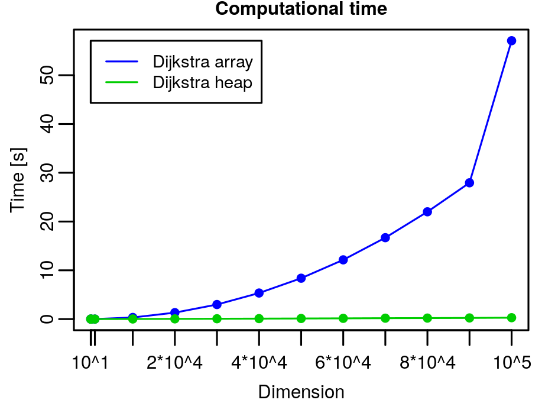

# Weighted Graphs: Homework

- *Implement the array-based version of the Dijkstra’s algorithm.*

  The solution with the implemented code can be found in the folder [06_Dijkstra](../06_Dijkstra). In particular, the file `ArrayPriorityQueue.c` contains the array-based version of a Priority Queue, and the function `dijkstra_array` in the file `Dijkstra.c` implements the array-based version of the Dijkstra algorithm.

  In the array-based version of Dijkstra's algorithm, we maintain the min-priority queue by taking advantage of the vertices being numbered $1$ to $|V|$. We simply store $v.d$ in the $v$-th entry of an array, then each time we scan the array to search for the minimum.

  Actually, I've inserted in each element of the Priority Queue's array an entire node. So the node $v$ with `key` 0 is in position 0, the node with `key` 1 is in position 1 and so on so forth. Then, I extract the elements according to the value of $v.d$: the minimum will be extracted.

  Each $\texttt{INSERT}$ and $\texttt{DECREASE_KEY}$ operation takes $O(1)$ time, and each $\texttt{EXTRACT_MIN}$ operation takes $O(|V|)$ time (since we have to search through the entire array), for a total time of $O(|V|^2 + |E|) = O(|V|^2)$.

- *Implement the binary heap-based version of the Dijkstra’s algorithm by using the library `binheap` that was developed during [Lesson 6](https://www.youtube.com/watch?v=TyHUQ1nn8WM), [Lesson 7](https://www.youtube.com/watch?v=lWFAPkgZ_7Q), and [Lesson 8](https://www.youtube.com/watch?v=4BnGCXzkFbo).*

  The solution with the implemented code can be found in the folder [06_Dijkstra](../06_Dijkstra). In particular, the function `dijkstra_binheap` in the file `Dijkstra.c` implements the heap-based version of the Dijkstra algorithm.

- *Test the implementations on a set of instances of the problem and compare their execution times.*

  The overall complexity of Dijkstra's algorithm is
  $$
  T_D(G) = \Theta(|V|) + T_B(|V|) + |V| * T_E(|V|) + |E| * T_U(|V|)
  \nonumber
  $$
  where $T_B$, $T_E$, and $T_U$ are the complexities of $\texttt{BUILD_QUEUE}$, $\texttt{EXCTRACT_MIN}$ and $\texttt{UPDATE_DISTANCE}$.

  Given the different data structures for the queue, we have the following table:

  | Queue Data Structure | $T_B(n)$    | $T_E(n)$    | $T_U(n)$    | $T_D(G)$                 |
  | -------------------- | ----------- | ----------- | ----------- | ------------------------ |
  | Arrays               | $\Theta(n)$ | $\Theta(n)$ | $\Theta(1)$ | $\Theta(|V|^2 + |E|)$    |
  | Binary heaps         | $\Theta(n)$ | $O(\log n)$ | $O(\log n)$ | $O((|V|+|E|) * \log|V|)$ |

  I've tested my implementation on graphs of $n$ nodes with $n$ edges, with $n \in \{10, 100, 1000, 10000, 20000, 30000, 40000, 50000, 60000, 70000, 80000, 90000, 100000\}$. The plot of the computational time is the following:

  

  As expected, the implementation with the heaps is much more efficient than the one with the arrays. Since in my tests I have $|V| = |E| = n$, we have that the array-based representation of the Dijkstra algorithm has a complexity of $\Theta(n^2)$, wile the heap-based representation of the Dijkstra algorithm of $O(n \log n)$. So for $n = 10^5$, we have that the arrays have a complexity of the order $(10^5)^2 = 10^{10}$, while the heaps of $17 * 10^5$, since $\log_2 10^5 \approx 17$.